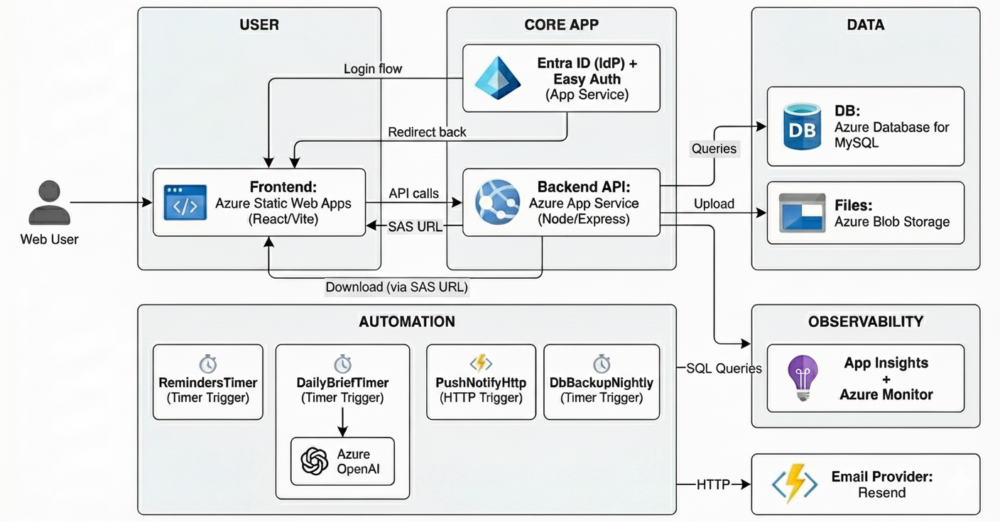

## Nimbus  

Nimbus è una piattaforma **cloud-native** progettata per la gestione avanzata di **note, task, allegati e collaborazione**, con un forte focus su **produttività personale**, **condivisione sicura** e **automazione intelligente** tramite servizi Microsoft Azure.

L’obiettivo del progetto è fornire un ambiente unificato in cui gli utenti possano:
- organizzare informazioni,
- rispettare le scadenze,
- collaborare in modo sicuro,
- ricevere supporto intelligente tramite funzionalità AI.

---

## Caratteristiche Principali

### Funzionalità Core
- **Gestione Note** con tagging dinamico
- **Allegati** (PDF, immagini, file) con storage sicuro
- **Storico versioni** e ripristino delle modifiche
- **Condivisione note** con ruoli (owner / editor / viewer)
- **Task Management** con priorità, scadenze e stati
- **Promemoria automatici** per task imminenti
- **Dashboard** con metriche, statistiche e panoramica attività
- **AI Daily Brief** per il riepilogo automatico della giornata
- **Notifiche email** centralizzate
- **Autenticazione enterprise** con Microsoft Entra ID

---

## Architettura Cloud

Nimbus segue un’architettura cloud-native basata sulla separazione dei responsibility layers. Il frontend è completamente disaccoppiato dal backend e comunica esclusivamente tramite API REST sicure. Le operazioni asincrone e 
pianificate (notifiche, promemoria, sintesi AI) sono delegate a componenti serverless, riducendo il carico applicativo e migliorando la scalabilità.

L’uso di servizi gestiti Azure (Database, Blob Storage, Entra ID) consente di minimizzare la complessità infrastrutturale e concentrarsi sulla logica applicativa.



### Frontend
- **React + Vite**
- Layout applicativo con Sidebar e routing protetto
- Autenticazione tramite **Azure Entra ID**
- UI responsive con modali e dashboard interattiva
- Hosting su **Azure App Service** / **Azure Static Web Apps**

### Backend
- **Node.js + Express**
- API REST per note, task, allegati e condivisioni
- Controllo permessi e ruoli applicativi
- Integrazione diretta con Azure Functions
- Hosting su **Azure App Service**

### Servizi Azure Utilizzati
- **Microsoft Entra ID**
  - Autenticazione e gestione identità
  - Easy Auth in produzione
- **Azure Database for MySQL**
  - Persistenza dati strutturati (utenti, note, task, permessi)
- **Azure Blob Storage**
  - Archiviazione allegati con accesso sicuro (SAS)
- **Azure Functions**
  - Invio notifiche email
  - Promemoria task pianificati
  - Daily Brief automatico
- **Azure OpenAI**
  - Sintesi intelligente di note e task
- **Azure Monitor** 
  - Monitoraggio prestazioni
- **Application Insights**
  -  Diagnostica
- **Azure App Service**
  - Host del backend
- **Azure Static Webapp**
  - Host del frontend

---

## Avvio con Docker (DEV)

```bash
cd deploy
docker compose up --build
```

Avvia frontend, backend e servizi necessari allo sviluppo locale.

---

## Documentazione

- README dedicati per backend, frontend, functions e deploy  
- JSDoc uniforme su controller, service e middleware  
- Documentazione architetturale e motivazioni progettuali  

---

## Contesto Accademico

Progetto sviluppato per il corso di **Cloud Computing**  
Università degli Studi di Salerno 

## Struttura del Progetto

```text
nimbus/
├── backend/        # API Node.js / Express
│   └── README.md
├── frontend/       # React + Vite
│   └── README.md
├── functions/      # Azure Functions (serverless)
│   └── README.md
├── deploy/         # Script e configurazioni di deploy
│   └── README_DEPLOY.md
├── .gitignore
├── init.sql
└── README.md    

--- 

